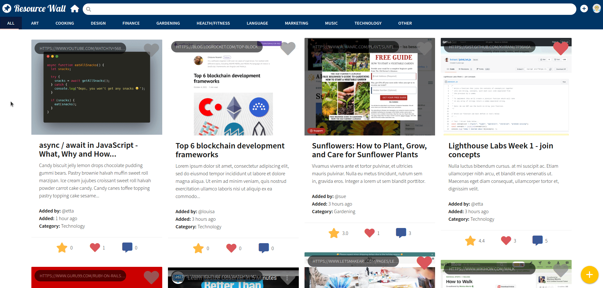
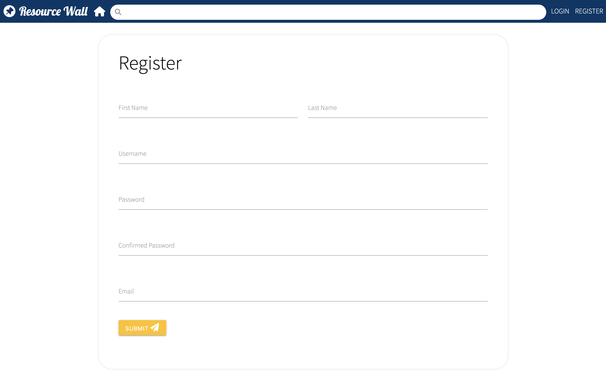
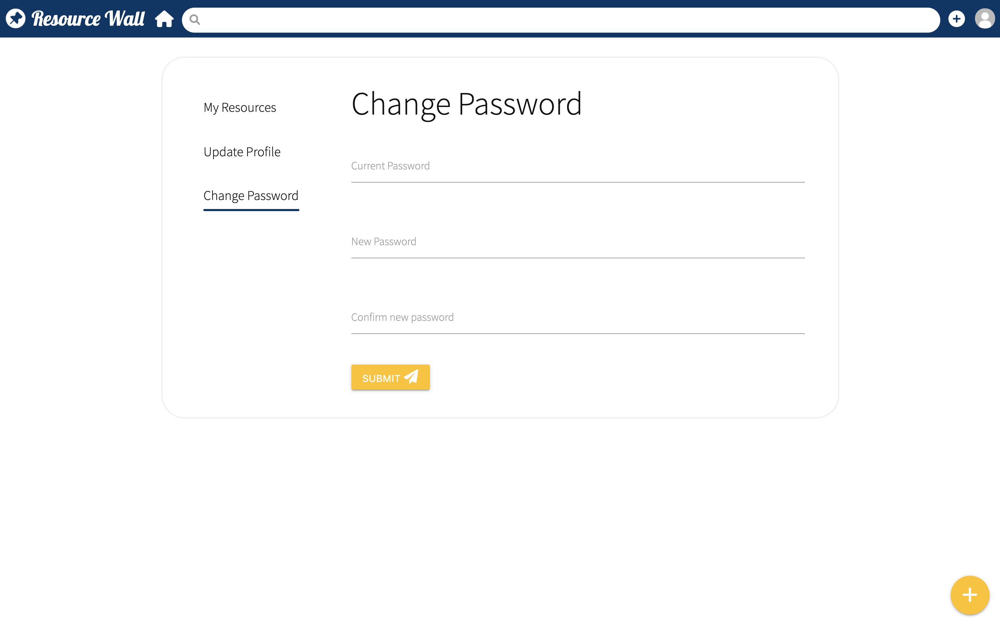
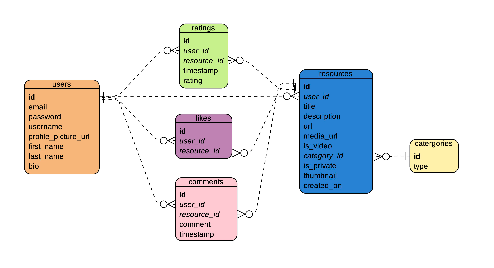

# Resource Wall

A full-stack single page application that allows learners to save learning resources in a central place that is publicly available to any user. This application was built using jQuery, NodeJS, Express, and PostgreSQL database.

This is one of the group projects for the Web Development Bootcamp at [Lighthouse Labs](https://www.lighthouselabs.ca/). The group members are [@navara99](https://github.com/navara99) and [@scc416](https://github.com/scc416).

## Table of Content

- [Live Demo](#live-demo)
- [Final Product](#final-product)
- [Dependencies](#dependencies)
- [Getting Started](#getting-started)
- [Repository Overview](#repository-overview)
- [ERD Diagram](#erd-diagram)
- [Credits](#credits)

## Live Demo

This project is deployed to [Heroku](https://heroku.com):  
https://the-resource-wall.herokuapp.com/

## Final Product

### Home page

- Display all the resources
- Users can like any resource
- Display screenshot/embed video uploaded by the user
- Display resource details such as title, description, owner's username, date added, rating, number of likes and comments
- Users can view resources by category

### Search

- Users can search for already-saved resources created by any user

### Create New Resource

- Users can save an external URL along with a title and description
- Users can make resource public/private
- Users can categorize resource under a topic
- Users can upload an image as thumbnail
- If there the user does not upload a thumbnail, a screenshot of the website will be used

### Resource Details Page

- Display details such as title, desciption, owner's username, added date, rating, list of comments, number of likes, ratings and comments,
- Users can comment/rate/like on any resources
- Users can enter user's page by clicking owner/comment

### My Resources (Edit/Delete)

- Users can view all their own and all liked resources on one page (with filter)
- Owner can edit/delete resource

### User Page

- Users can view user's details (Profile picture, username, bio, full name, created resources)

### Login

- Users can login with email/username and password

### Logout

- Users can logout

### Register

- Users can regsiter with email (unique), password (enter twice) , username (unique)

### Update profile

- Users can update their profile (email, username, bio, first name, last name, link for profile picture)

### Change Password

- Users can change their password

### Handle error

- If there is any errors, it is shown on the top of the page under nav bar

### Handle History

- History.js is used to managed the history of this single page app

## Getting Started

1. Create the `.env` by using `.env.example` as a reference: `cp .env.example .env`
2. Update the .env file with your correct local information  
   The file has to include your own `IFRAME_KEY` (from [Iframely](https://iframely.com/)) and `APIKEY` (from [Screenshot Machine](https://www.screenshotmachine.com/)). Both of them are free.
3. Install dependencies: `npm i`
4. Fix to binaries for sass: `npm rebuild node-sass`
5. Reset database: `npm run db:reset`

- Use the `npm run db:reset` command each time there is a change to the database schema or seeds.

  - It runs through each of the files, in order, and executes them against the database.
  - Note: you will lose all newly created (test) data each time this is run, since the schema files will tend to `DROP` the tables and recreate them.

- Check the db folder to see what gets created and seeded in the SDB

7. Run the server: `npm run local`

- Note: nodemon is used, so you should not have to restart your server

8. Visit `http://localhost:8080/`

## Dependencies

- [Node](https://nodejs.org/en/): 10.x or above.
- [NPM](https://www.npmjs.com/): 5.x or above.

### Frontend

- [jQuery](https://jquery.com/): Used for DOM manipulation
- [history.js](https://github.com/browserstate/history.js/): To manage browser history
- [Materialize](https://materializecss.com/): A front-end library based on Google's [material design](https://en.wikipedia.org/wiki/Material_Design)
- [timeago](https://timeago.yarp.com/): To convert javascript timestamps to a user friendly format

### Backend

- [express](http://expressjs.com/): Provide server side logic
- [ejs](https://ejs.co/): Embedded JavaScript (EJS) templating language
- [PG 6.x](https://www.postgresql.org/): PostgreSQL client for Node.js
- [sass](https://sass-lang.com/): Preprocessor scripting language that compiles into CSS
- [axios](https://www.axios.com/): To make API requests to the back-end
- [bcryptjs](https://github.com/dcodeIO/bcrypt.js): A library to help hash passwords
- [cookie-session](https://github.com/expressjs/cookie-session): Used to save the user session
- [chalk](https://github.com/chalk/chalk): Used to style string in the terminal
- [dotenv](https://dotenv.org/): Used to load variables from .env files
- [morgan](https://github.com/expressjs/morgan): HTTP request logger middleware for node.js
- [multer](https://github.com/expressjs/multer): Used to allow users to upload thumbnails
- [valid-url](https://github.com/ogt/valid-url): To check if the url entered by user is a valid url

## Repository Overview

<pre>
📦resource-wall
 ┣ 📂.git
 ┣ 📂db
 ┃ ┣ 📂schema
 ┃ ┣ 📂seeds
 ┃ ┗ 📜query-helpers.js
 ┣ 📂docs
 ┣ 📂lib
 ┃ ┣ 📜db.js
 ┃ ┗ 📜sass-middleware.js
 ┣ 📂public
 ┃ ┣ 📂images
 ┃ ┃ ┗ 📜favicons.png
 ┃ ┣ 📂scripts
 ┃ ┃ ┣ 📂components
 ┃ ┃ ┃ ┣ 📂resource-details
 ┃ ┃ ┃ ┃ ┣ 📂helpers
 ┃ ┃ ┃ ┃ ┃ ┣ 📜comment.js
 ┃ ┃ ┃ ┃ ┃ ┣ 📜like.js
 ┃ ┃ ┃ ┃ ┃ ┗ 📜rating.js
 ┃ ┃ ┃ ┃ ┗ 📜main.js
 ┃ ┃ ┃ ┣ 📜edit-resource.js
 ┃ ┃ ┃ ┣ 📜error.js
 ┃ ┃ ┃ ┣ 📜header.js
 ┃ ┃ ┃ ┣ 📜home.js
 ┃ ┃ ┃ ┣ 📜login.js
 ┃ ┃ ┃ ┣ 📜my-resources.js
 ┃ ┃ ┃ ┣ 📜new-resource.js
 ┃ ┃ ┃ ┣ 📜profile.js
 ┃ ┃ ┃ ┣ 📜register.js
 ┃ ┃ ┃ ┗ 📜user-page.js
 ┃ ┃ ┣ 📜constants.js
 ┃ ┃ ┣ 📜network.js
 ┃ ┃ ┗ 📜view.js
 ┃ ┣ 📂styles
 ┃ ┃ ┣ 📜layout.css
 ┃ ┃ ┗ 📜main.css
 ┃ ┣ 📂uploads
 ┃ ┃ ┗ 📜.gitkeep
 ┃ ┗ 📂vendor
 ┃ ┃ ┣ 📜border-box.css
 ┃ ┃ ┣ 📜jquery-3.0.0.js
 ┃ ┃ ┗ 📜normalize-4.1.1.css
 ┣ 📂routes
 ┃ ┣ 📂json
 ┃ ┃ ┗ 📜providers.json
 ┃ ┣ 📂routeHelpers
 ┃ ┃ ┗ 📜mediaHelpers.js
 ┃ ┣ 📜resources.js
 ┃ ┗ 📜users.js
 ┣ 📂styles
 ┃ ┣ 📜error.scss
 ┃ ┣ 📜home.scss
 ┃ ┣ 📜layout.scss
 ┃ ┣ 📜main.scss
 ┃ ┣ 📜my-resources.scss
 ┃ ┣ 📜nav.scss
 ┃ ┣ 📜new-resource.scss
 ┃ ┣ 📜resource-details.scss
 ┃ ┗ 📜user-page.scss
 ┣ 📂views
 ┃ ┣ 📂my-resources
 ┃ ┃ ┣ 📜change-password.ejs
 ┃ ┃ ┣ 📜edit-resource.ejs
 ┃ ┃ ┣ 📜main.ejs
 ┃ ┃ ┣ 📜my-resources.ejs
 ┃ ┃ ┗ 📜update-profile.ejs
 ┃ ┣ 📜error.ejs
 ┃ ┣ 📜index.ejs
 ┃ ┣ 📜login.ejs
 ┃ ┣ 📜nav.ejs
 ┃ ┣ 📜new-resource.ejs
 ┃ ┣ 📜register.ejs
 ┃ ┣ 📜resource-details.ejs
 ┃ ┣ 📜resources.ejs
 ┃ ┣ 📜scripts.ejs
 ┃ ┣ 📜stylesheet.ejs
 ┃ ┣ 📜tabs.ejs
 ┃ ┗ 📜user-page.ejs
 ┣ 📜.editorconfig
 ┣ 📜.env.example
 ┣ 📜.eslintrc.json
 ┣ 📜.gitignore
 ┣ 📜README.md
 ┣ 📜package-lock.json
 ┣ 📜package.json
 ┗ 📜server.js
</pre>

### 📂db

#### 📂schema

Contain sql files that created tables.

#### 📂seeds

Contain sql files with dumb data.

#### 📜query-helpers.js

Contains the functions that interact with the database.

#### 📂docs

Contain images for `README.md`.

### 📂public

#### 📂images

Contains the favicons.

#### 📂scripts

Contains the javascript files for manipulating the front end.

#### 📂styles

Contains the css files that is compiled from the scss files.

#### 📂uploads

Contains only a file `.gitkeep`. This folder is where the uploaded thumbnails will be saved.

### 📂routes

#### 📂json

Contains a file `providers.json`, which includes the oembed details for generating resources' `media_url`.

#### 📂routeHelpers

Contains `mediaHelpers.js`. The file has functions that generate `media_url` from `providers.json` and API of [Screenshot Machine](https://www.screenshotmachine.com/).

#### 📜resources.js

Contains route of the servers that interact with the `resources`, `likes`, `comments` and `ratings` tables in the database.

#### 📜users.js

Contains route of the servers that interact with the `users` table in the database.

### 📂styles

Contains scss files that are compiled into css files.

#### 📂views

Contains the ejs files.

#### 📜.env.example

Reference for creating `.env`.

#### 📜.gitignore

Contains files that are ignored by `git`.

#### 📜README.md

The document that you are reading.

#### 📜package.json

This file contains:

- dependencies: node libraries that the code needs
- dev-dependencies: node libraries only needed by development tools
- scripts: Define the in-project shortcut commands

#### 📜server.js

The main file where the server is defined.

## ERD Diagram

The database consists of 6 tables:

- users
- resources
- categories
- likes
- comments
- ratings

## Credits

- Favicons made by [I Wayan Wika](https://www.flaticon.com/authors/i-wayan-wika) from [www.flaticon.com](https://www.flaticon.com/), modified by [@scc416](https://github.com/scc416)
